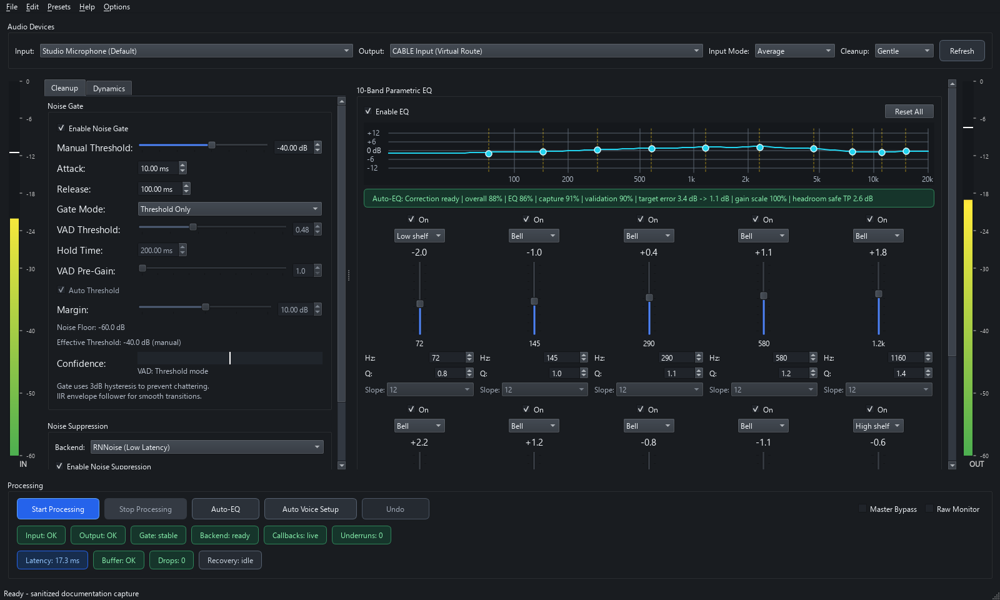
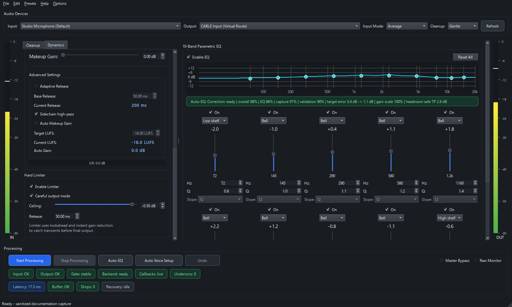
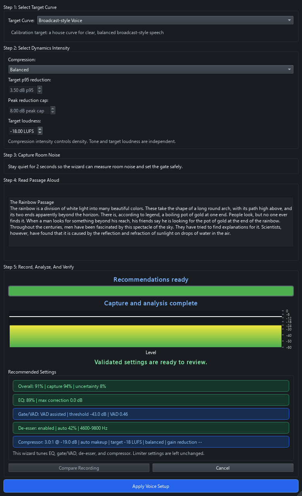

# AudioForge

[](https://opensource.org/licenses/MIT)
[](https://www.python.org/downloads/)
[](https://www.rust-lang.org/)
[]()

AudioForge is a Windows microphone processor for people who want a cleaner live mic without sending audio through a cloud service. It combines a Rust realtime audio core with a PyQt desktop UI for noise suppression, smart gating, Auto-EQ, Auto Voice Setup, latency calibration, and dynamics control.

Current version: `v1.11.4`

## Download

Download the latest published Windows build from the
[latest AudioForge release](https://github.com/FueledByRedBull/audio-forge/releases/latest):

- Published archive: `AudioForge-v<version>-win64-ultra.7z`
- Checksum: use the matching `.7z.sha256` sidecar published by the release workflow.

The portable bundle is self-contained. Extract it and run `AudioForge.exe`.

## What It Does

AudioForge sits between your microphone and your output/virtual routing path. It is built for voice work where reliability matters: streaming, calls, recording chains, monitoring, and calibration-heavy setups.

### Routing and editable EQ



### Dynamics processing



### Auto Voice Setup



The screenshots use deterministic sanitized state. Regenerate them with
`python/tools/capture_repository_screenshots.py`; automated checks cover their
dimensions, hashes, alt text, and privacy boundary.

User-facing tools:

- AI noise suppression with RNNoise and optional DeepFilterNet backends.
- Smart noise gate with threshold-only, VAD-assisted, and VAD-only modes, including smoothed continuous VAD-posterior gain control around uncertain speech.
- Auto thresholding that tracks the live noise floor in VAD modes.
- 10-band parametric EQ with per-band bell, notch, shelf, and pass filters,
  click-safe bypass, selectable 12–48 dB/octave Butterworth pass slopes, and
  constrained mouse/keyboard graph editing synchronized with numeric controls.
- Auto-EQ calibration that combines energy and Silero speech posteriors, rejects shape outliers, uses matched noise-referenced per-band reliability when available, and abstains when a safe correction is unsupported.
- Auto-EQ headroom validation through the native chain simulator; Python-only fallback results are visibly advisory.
- Auto Voice Setup with noise-reference integrity checks, Silero-posterior-aware speech masking, calibrated soft de-esser fusion, independent Gentle/Balanced/Dense/Custom dynamics intensity, bounded multi-parameter native compressor calibration (threshold, ratio, attack, release), and guided second-passage verification.
- Dynamic-EQ de-esser, compressor with speech-aware auto makeup gain driven by calibrated VAD and noise-floor evidence, and lookahead limiter.
- Band-limited 4x true-peak detection and limiting, validated against an independent offline reference.
- Stateful phase-safe mono alignment and adaptive 49-61 Hz hum/harmonic tracking for difficult input sources.
- Per device-pair route-aware latency calibration profiles; measured output-to-input route delay is applied directly instead of assuming symmetric one-way latency.
- Raw monitor and bypass paths for troubleshooting.
- Bounded full-processing undo/redo (`Ctrl+Z` / `Ctrl+Shift+Z`) for manual
  edits, presets, Auto-EQ, and Auto Voice Setup, with realtime state excluded.

Presets use a versioned typed-band schema; migration tests preserve explicit
user values and response parity. The graph and numeric controls share that
schema and the native Rust response renderer. Undo snapshots contain validated
processing settings only—not audio, device handles, DSP delay state, or meter
history. These contracts are enforced by the config, EQ, graph, and history
tests rather than duplicated across separate design documents.

Operational tools:

- Input/output meters and runtime diagnostics.
- Dropped-sample, backlog, callback-stall, and recovery counters.
- Stream restart/backoff handling.
- Device refresh that preserves current selections when possible.
- Portable PyInstaller packaging with bundled runtime assets.

## Status

AudioForge currently supports Windows 10/11 only. Source builds, CI, portable `dist/AudioForge` packaging, runtime assets, device recovery behavior, and desktop identity integration are validated on Windows. Linux and macOS builds are not supported today, even though parts of the Rust audio stack use cross-platform libraries.

DeepFilterNet support is intentionally opt-in for source runs. Packaged builds register and enable verified bundled assets during application bootstrap; RNNoise remains the safe default when those assets are absent. External DLL/model paths are ignored unless `AUDIOFORGE_ALLOW_EXTERNAL_DF=1` is explicitly set.
DeepFilter model/DLL initialization and Silero VAD inference are prepared off the realtime DSP loop; the audio path only swaps ready suppressor state and consumes cached VAD probabilities.

Objective DSP decisions and release evidence are indexed in
[`evaluation/README.md`](evaluation/README.md). Tracked reports contain compact
aggregates, gates, hashes, decisions, and limitations; raw per-case details are
optional ignored outputs, not repository content.

## DSP Chain

Normal processing path:

```text
Mic Input -> Input Cleanup (DC block + one selected/adaptive HP) -> Noise Gate -> Noise Suppression
-> De-Esser -> 10-Band EQ -> Compressor -> Limiter -> Output
```

Special paths:

- `Bypass` keeps the transport path active while skipping the main DSP stages.
- `Raw Monitor` uses the clean write path and skips the pre-filter and downstream DSP chain for diagnostics.

Latency labels in the UI describe suppressor/DSP behavior, not a universal round-trip value. Calibration measures the selected output-to-input route and applies that route delay directly; a directional one-way split is left unset unless independently measured. End-to-end latency still depends on the selected devices, driver mode, buffer sizing, and routing path.

## Requirements

- Windows 10/11
- Python 3.10+
- Rust 1.83+
- `maturin`
- A virtual environment in `.venv` is assumed by the packaging script.

## Quick Start From Source

```powershell
git clone https://github.com/FueledByRedBull/audio-forge.git
cd audio-forge

python -m venv .venv
.\.venv\Scripts\python.exe -m pip install --require-hashes -r requirements/dev.txt
.\.venv\Scripts\python.exe -m pip install --no-deps --no-build-isolation -e .

.\.venv\Scripts\python.exe -m maturin develop --release
.\.venv\Scripts\python.exe -m mic_eq
```

You can also use the installed console entrypoint:

```powershell
.\.venv\Scripts\mic-eq.exe
```

## Configuration

RNNoise is the default safe noise-suppression backend. DeepFilterNet is opt-in for source and development runs; set `AUDIOFORGE_ENABLE_DEEPFILTER=1` after registering app-owned assets or when intentionally using opted-in external assets. Packaged builds register canonical bundled DLL/model paths and auto-enable DeepFilterNet when both are present.

See [Development Assets](#development-assets) for the full runtime asset and environment-variable list.

## Using The App

1. Select input and output devices.
2. Start processing.
3. Choose a suppressor backend and gate mode.
4. Tune EQ/dynamics manually, run Auto-EQ, or run Auto Voice Setup for a broader voice-chain calibration.
5. Run latency calibration if the current device route needs compensation.

Useful behavior to know:

- Device refresh keeps the current selection when the same device is still available.
- Input/output stream setup prefers 48 kHz configs when available.
- In VAD modes, auto threshold is the default path; the UI shows live noise floor and effective threshold.
- Phase-safe mono retains fractional-delay history across input callbacks instead of re-estimating from isolated blocks.
- Adaptive cleanup tracks off-nominal mains hum and its harmonic with fractional frequency/phase continuity, and selects one high-pass response instead of cascading filters.
- Auto-EQ and Auto Voice Setup use native Silero posteriors when available and report an explicit energy-analysis fallback when they are not.
- Auto Voice Setup rejects unusable room tone, restricts boosts for questionable references, and reports device/time/channel mismatch or recapture guidance.
- Voice Setup candidates remain temporary until a second passage produces an explicit accept, reduce, retry, or rollback decision from repeatability and exact downstream native-chain checks. This is engineering validation, not a listening-preference claim.
- Preset loading preserves saved `VAD Assisted` and `VAD Only` gate modes instead of collapsing them back to `Threshold Only`.
- Diagnostics separate input drops, backlog recovery, output recovery, output short-write loss, and active output underrun streaks. Historical output underrun and recovery totals stay visible without forcing the health chip into a warning state after the stream has recovered.
- `Help > Export Diagnostics...` writes a versioned, size-bounded support
  snapshot. It allowlists configuration and runtime health fields,
  pseudonymizes device identities with report-local keys, and excludes raw
  audio, raw device names, environment variables, secrets, and arbitrary
  paths.

## Development Assets

Full-feature development and release builds use the tracked `release-assets.json` manifest. Obtain each listed asset from the documented source, place it at the manifest `path`, and verify before packaging:

```powershell
.\.venv\Scripts\python.exe python/tools/verify_release_assets.py
```

For a cleaner fresh-clone setup, you can hydrate those assets from the matching GitHub release:

```powershell
.\.venv\Scripts\python.exe python/tools/fetch_release_assets.py
```

The fallback release is pinned once in `release-assets.json`; it is an asset
source, not the application version. Silero v6.2.1 is downloaded directly from
the immutable source recorded in the same manifest; every file is then verified
by size and SHA-256.

Create `models/` in the repo root for local runtime discovery:

- `models/DeepFilterNet3_ll_onnx.tar.gz`
- `models/DeepFilterNet3_onnx.tar.gz`
- `models/silero_vad.onnx`

DeepFilter runtime library:

- `df.dll` in the repo root for development runs.
- `target/release/DirectML.dll` from the pinned DirectML redistributable package for full-feature packaging.
- Bundled under `dist/AudioForge/_internal` for portable builds.

Environment variables:

- `AUDIOFORGE_ENABLE_DEEPFILTER=1`
- `AUDIOFORGE_ALLOW_EXTERNAL_DF=1`
- `DEEPFILTER_MODEL_PATH`
- `DEEPFILTER_LIB_PATH`
- `VAD_MODEL_PATH`
- `AUDIOFORGE_FIXED_INPUT_BUFFER_FRAMES`
- `AUDIOFORGE_FIXED_OUTPUT_BUFFER_FRAMES`

Packaged builds use bootstrap-registered canonical DeepFilter assets by default. Ambient `DEEPFILTER_LIB_PATH` and `DEEPFILTER_MODEL_PATH` values are ignored. Set `AUDIOFORGE_ALLOW_EXTERNAL_DF=1` only when you intentionally want a valid external path to take precedence; any missing external path falls back to the registered bundled asset.

The two fixed-buffer variables are optional diagnostics for callback-size
consistency. Values must be 16–8192 frames and fit the endpoint's advertised
range; AudioForge preflights the request and otherwise keeps the driver default.

## Build Portable EXE

Build the Rust extension first, then package:

```powershell
.\.venv\Scripts\python.exe python/tools/fetch_release_assets.py
.\.venv\Scripts\python.exe -m maturin develop --release
powershell -ExecutionPolicy Bypass -File .\build_exe.ps1
```

Packaging script behavior:

- Uses the locally built `python/mic_eq/mic_eq_core*.pyd`.
- Fails if the local native extension is older than Rust sources.
- Validates required full-feature runtime assets against `release-assets.json`.
- Reuses PyInstaller's analysis cache by default; pass `-Clean` for a cold PyInstaller rebuild.
- Bundles the Python runtime with PyInstaller.
- Bundles AudioForge, DeepFilterNet, Silero VAD, and DirectML license notices.
- Writes `_internal/audioforge-build.json`; package smoke rejects a bundle whose version differs from the source tree.
- Prunes unused Qt payload, duplicate native-extension payload, and app-local
  UCRT/API-set files with `python/tools/prune_bundle.py` while retaining
  dependency metadata and licenses. AudioForge supports Windows 10/11 and
  relies on the operating system UCRT, which Windows always uses on those
  versions even if a local copy is present.
- The release profile strips native symbols, and packaging excludes only unused
  SciPy namespaces plus Qt SVG payloads. Each candidate emits generated
  artifact metadata and a per-file bundle manifest; do not copy candidate
  sizes, file counts, or hashes into pre-release prose.
- Keeps the application self-contained in `dist/AudioForge`.

Portable output:

- `dist/AudioForge/AudioForge.exe`
- Bundled assets and runtime files under `dist/AudioForge/_internal`

## Create Release Archive

The portable folder is intended to be archived as a single distributable:

```powershell
& "C:/Program Files/7-Zip/7z.exe" a -t7z -mx=9 -m0=lzma2 -mmt=on -ms=on `
  .\AudioForge-v1.11.4-win64-ultra.7z .\dist\AudioForge\*
```

The v1.10.0 bundle was measured with ZIP/Deflate, tar.gz, tar.xz, tar.zst,
solid LZMA, and solid LZMA2. The command above was the smallest verified
format. Treat the generated `.metadata.json`, `.manifest.json`, and `.sha256`
sidecars beside a release archive as authoritative. See
`evaluation/archive-format-benchmark.json` for the historical format
comparison.

## Testing

CI-equivalent checks:

The current Semgrep release pins `mcp==1.23.3` for its optional MCP server;
AudioForge only invokes `semgrep scan`, so the three upstream MCP advisories
are listed explicitly below until Semgrep publishes a compatible pin. Runtime
dependencies remain unignored.

```powershell
.\.venv\Scripts\python.exe -m ruff check python/mic_eq python/tests python/tools
.\.venv\Scripts\python.exe -m pyright
.\.venv\Scripts\python.exe -m pytest python/tests -q
.\.venv\Scripts\python.exe -m pip_audit --require-hashes -r requirements/runtime.txt
.\.venv\Scripts\python.exe -m pip_audit --require-hashes -r requirements/dev.txt `
  --ignore-vuln PYSEC-2026-3481 `
  --ignore-vuln PYSEC-2026-3482 `
  --ignore-vuln PYSEC-2026-3483
.\.venv\Scripts\python.exe python/tools/run_semgrep.py --sarif semgrep-results.sarif
.\.venv\Scripts\python.exe python/tools/check_versions.py
.\.venv\Scripts\python.exe python/tools/check_workflows.py
.\.venv\Scripts\python.exe python/tools/package_smoke.py --source-only
cargo fmt --check
cargo audit
cargo test -p mic_eq_core
cargo test --release -p mic_eq_core --test stress_tests seeded_control_and_dsp_loops_remain_finite_under_contention
cargo test --release -p mic_eq_core audio::input::tests::benchmark_phase_safe_mono_callback_cost -- --ignored --nocapture
cargo test --release -p mic_eq_core dsp::biquad::tests::benchmark_biquad_morph_cost -- --ignored --nocapture
cargo clippy -p mic_eq_core --all-targets -- -D warnings
```

Packaged-build smoke check after `build_exe.ps1`:

```powershell
.\.venv\Scripts\python.exe python/tools/verify_release_assets.py
.\.venv\Scripts\python.exe python/tools/package_smoke.py
```

Headless runtime checks:

```powershell
.\.venv\Scripts\python.exe python/tools/health_check.py --duration 1800
.\.venv\Scripts\python.exe python/tools/self_test.py
.\.venv\Scripts\python.exe python/tools/evaluate_hardware_validation.py `
  --health-input "<microphone>" --health-output "<virtual output>" `
  --correlation-input "<loopback input>" --correlation-output "<loopback output>"
```

## Repository Layout

- `python/mic_eq`: PyQt application, analysis code, persistence, and source/development entrypoints.
- `rust-core`: Rust audio engine exposed through PyO3.
- `python/tests`: Python test suite.
- `python/tools`: health, package, and release validation helpers.
- `.github/workflows/ci.yml`: Windows CI for Python and Rust checks.
- `build_exe.ps1`: PyInstaller packaging script.
- `AudioForge.spec`: canonical portable package definition.
- `launcher.py`: PyInstaller/frozen-app launcher used by `AudioForge.spec`; source/development runs use `python -m mic_eq` or the `mic-eq` console entrypoint.

## Roadmap

Versioned [GitHub milestones](https://github.com/FueledByRedBull/audio-forge/milestones)
and issues carrying the
[`roadmap` label](https://github.com/FueledByRedBull/audio-forge/issues?q=is%3Aissue+label%3Aroadmap)
are the source of truth for planned work and explicit holds. Keep personal
working notes outside the repository and do not treat them as authoritative.

## License

MIT License. See [LICENSE](LICENSE).

## Acknowledgments

- RNNoise by Jean-Marc Valin
- DeepFilterNet by Hendrik Schroter and contributors
- Silero VAD contributors
