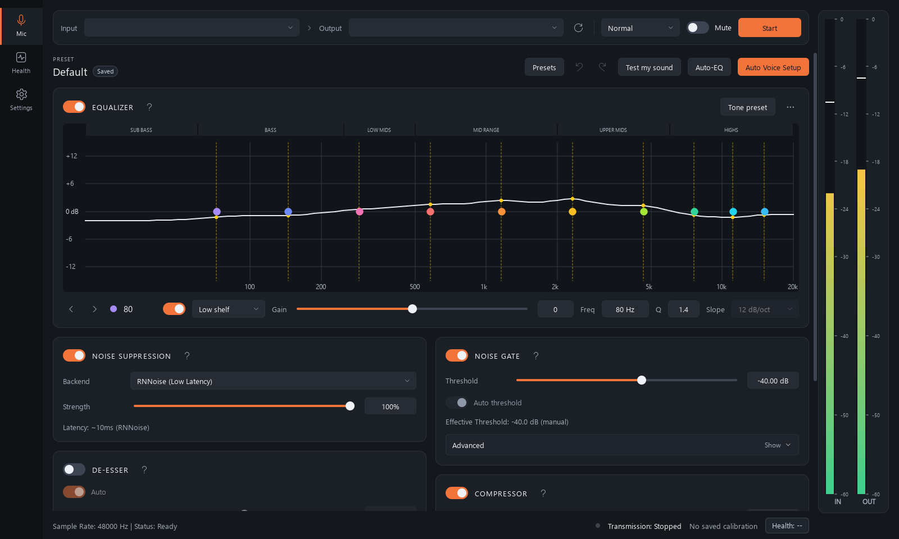
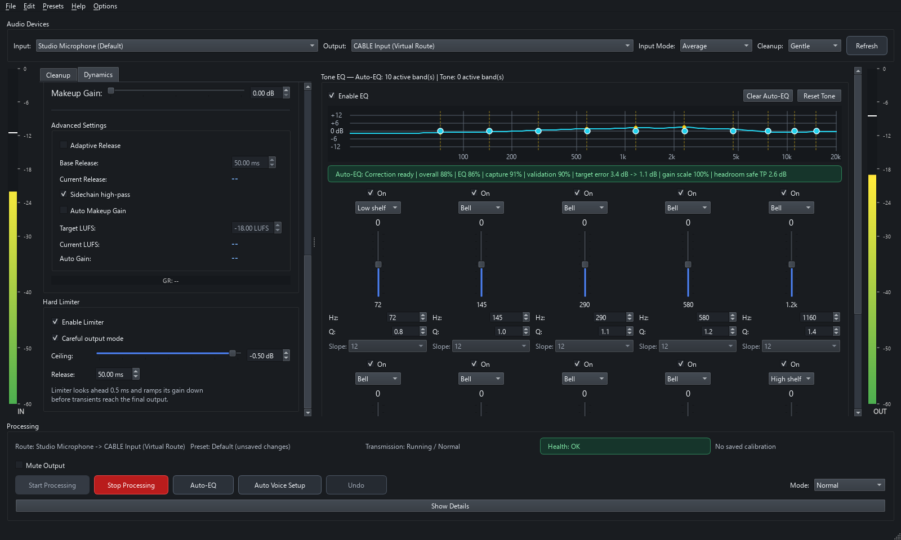
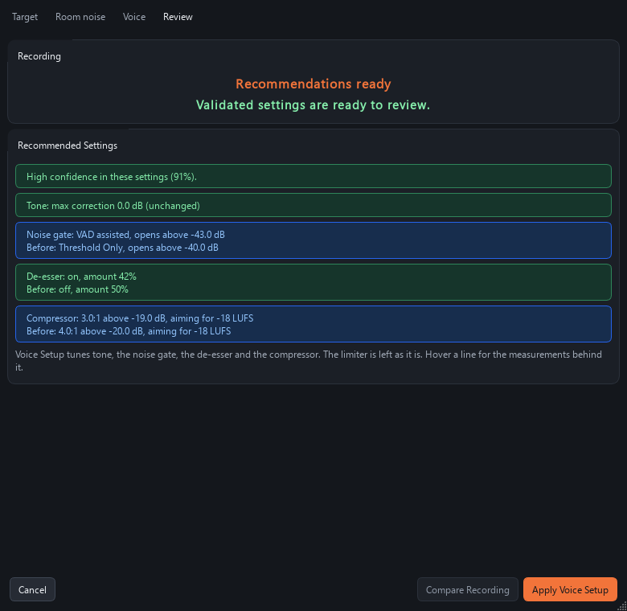

# AudioForge

**Remove background noise and polish your voice for calls, streams, and
recordings. Everything is processed on your Windows PC.**

[](https://github.com/FueledByRedBull/audio-forge/releases/latest)
[](#compatibility)

AudioForge sits between your microphone and the apps you talk in. It cuts
background noise, evens out your level, tames harsh "s" sounds and sudden
peaks, and lets you shape your tone. A guided setup tests its suggestions on
your own recording before you apply them. No account and no cloud service:
your audio never leaves your PC.

**[Download for Windows](https://github.com/FueledByRedBull/audio-forge/releases/latest)** · [Set up in five steps](#set-up) · [What it does](#what-it-does) · [No sound?](#no-sound)



> [!IMPORTANT]
> **To use AudioForge in Discord, OBS, Zoom, or Teams, you also need a virtual
> audio cable.** AudioForge doesn't install one. It is tested with the free
> [VB-CABLE](https://vb-audio.com/Cable/); other virtual cables should work but
> haven't been tested. You don't need a cable to monitor yourself on headphones.

## What It Does

| Your goal | What AudioForge gives you |
| --- | --- |
| Remove background noise | RNNoise or DeepFilterNet noise suppression, a speech-aware noise gate, and hum cleanup. |
| Sound consistent | A compressor with speech-aware automatic makeup gain, plus peak protection that stops clipping. |
| Shape your voice | A ten-band EQ you can drag or type into, Auto-EQ, and guided Auto Voice Setup. |
| Tame harshness | A de-esser that turns down sharp "s" and "sh" sounds only when they occur. |
| Stay in control | Presets, undo and redo, a global mute shortcut, level meters, and health indicators. |

<details>
<summary>More screenshots: dynamics and Auto Voice Setup</summary>

### Dynamics



### Auto Voice Setup



</details>

Screenshots use example devices and settings.

## Download

Current version: `v1.13.0` ([release notes](release-notes/release-notes-v1.13.0.md)).
Open the [latest release](https://github.com/FueledByRedBull/audio-forge/releases/latest)
and download **one** of these files. **Not sure? Choose the installer.**

- **Installer (recommended):** `AudioForge-v<version>-win64.msi`, where
  `<version>` is the release number. Run it, then open AudioForge from the Start
  menu. It installs for your Windows user only.
- **Portable folder:** `AudioForge-v<version>-win64-ultra.7z`. Extract the whole
  archive, then run `AudioForge.exe`. If Windows can't open `.7z` files, use
  [7-Zip](https://www.7-zip.org/). "Ultra" is the compression level, not a
  different edition.

Both are about 100 MB and include everything the app needs; you don't need
Python or Rust. The other files on the release page (source code, validation
evidence, and checksums) are for verification and redistribution.

**Windows SmartScreen:** AudioForge isn't code-signed, so Windows may show
"Windows protected your PC". Download only from this repository's Releases
page. To confirm the file is intact, run `Get-FileHash <file>` in PowerShell
and compare the result with the matching line in
`AudioForge-v<version>-SHA256SUMS.txt`. Then choose **More info > Run anyway**.

## Set Up

1. **Install a virtual cable (once).** Install
   [VB-CABLE](https://vb-audio.com/Cable/) and restart if its installer asks you
   to. Skip this step if you only want to listen on headphones.
2. **Choose devices in AudioForge.** Set **Input** to your microphone and
   **Output** to **CABLE Input (VB-Audio Virtual Cable)**. To hear yourself
   first, choose your headphones as Output instead.
3. **Point your app at the cable.** In Discord, OBS, Zoom, or Teams, set the
   microphone (input device) to **CABLE Output (VB-Audio Virtual Cable)**.
4. **Start and check.** Press **Start Processing** and speak. The AudioForge
   meters and your app's input meter should both move, and a short test
   recording in your app should contain your processed voice.
5. **Tune and save.** Noise suppression starts with RNNoise, the low-latency
   default. Run **Auto Voice Setup** for a guided starting point, or adjust the
   EQ and dynamics yourself. Press **Ctrl+S** to save a preset when it sounds
   right.

AudioForge opens with processing stopped. **Stop Processing** keeps the window
open. Closing the window stops audio and quits, unless you turn on
close-to-tray in **Options > Tray & Background**. Then audio keeps running and
you quit from **File > Exit** or **Quit AudioForge** in the tray. AudioForge
doesn't start with Windows.

### No sound?

- Check that processing is started and **Mute Output** is off.
- Check the pair: AudioForge's **Output** is **CABLE Input**, and your app's
  microphone is **CABLE Output**. The two names are easy to swap.
- In Windows Settings, microphone privacy must allow desktop apps to use your
  microphone.
- Watch the meters to see where the signal stops. If AudioForge's input meter
  stays still, check the microphone. If AudioForge's output moves but your
  app's meter doesn't, check the cable selection in your app.
- Still stuck? [Open an issue](https://github.com/FueledByRedBull/audio-forge/issues/new/choose)
  and attach **Help > Export Diagnostics...**. The export excludes audio and
  real device names; check it before you share it.

## Everyday Controls

- **Processing mode:** **Normal** runs the full chain. **Bypass** skips voice
  effects but keeps input cleanup and output protection. **Raw** also skips
  input cleanup, for troubleshooting.
- **Compare Recording:** after calibration, hear the same passage as original,
  current, and proposed processing before you apply anything.
- **Shortcuts:** **Ctrl+S** saves your preset, **Ctrl+Shift+S** saves a copy,
  and **Ctrl+Z** / **Ctrl+Shift+Z** undo and redo. **Ctrl+Alt+M** mutes from
  anywhere once you enable it in **Options > Tray & Background**.
- **Unsaved changes:** quitting or switching presets offers Save, Discard, or
  Cancel.

<details>
<summary>How Auto-EQ and Auto Voice Setup make their suggestions</summary>

- **Two EQ stages.** Calibration writes a correction stage. Your own edits go
  in a separate tone stage, so changing gains, templates, filter types, or
  slopes keeps the calibration. Older presets keep their combined EQ as the
  tone stage.
- **Your voice stays yours.** Speech alone can't reveal a microphone's exact
  frequency response, so automatic targets keep the recorded voice and apply
  bounded tonal preferences. Natural / No Added Tone stays neutral. Warm / Full
  Voice adds low-mid body with restrained upper presence; Adaptive keeps it
  subtle and Static uses the stronger catalog curve.
- **Suggestions have to earn a change.** Auto Voice Setup tries gate and noise
  suppression options with the proposed dynamics on part of your recording.
  It keeps your current settings unless a candidate passes safety and
  speech-preservation checks and improves a separate part of the recording.
  DeepFilterNet settings stay within DeepFilterNet, because automatic switches
  back to RNNoise failed clean-speech checks. CPU timing is only a pass/fail
  limit; it never ranks sound quality.
- **Compression and loudness.** EQ is fitted first. Compression calibration
  then tunes the threshold with your requested automatic makeup gain. If your
  target loudness can't leave safe headroom, the result stays advisory: choose
  a lower (more negative) LUFS target and run it again.
- **Verified before it sticks.** A suggestion stays temporary until a second
  passage checks it through the full chain. Adjustments reuse a valid take, and
  your previous sound comes back if verification can't succeed. Recorded
  checks can't reproduce live device dropouts, so confirm the result in your
  destination app.

</details>

<details>
<summary>Full feature reference</summary>

Sound processing:

- Noise suppression with RNNoise or DeepFilterNet (both included).
- Noise gate with Threshold Only, VAD Assisted, and VAD Only modes, smooth
  speech-confidence gain control, and an automatic threshold that tracks the
  room's noise floor in the VAD modes.
- Ten-band EQ with bell, notch, shelf, and pass filters, 12–48 dB/octave pass
  slopes, click-free bypass, and drag or keyboard editing on the graph.
- Auto-EQ that uses speech detection, rejects unreliable parts of a capture,
  and declines to correct when a safe correction isn't supported.
- Dynamic-EQ de-esser, compressor with speech-aware automatic makeup gain, and
  lookahead limiter.
- True-peak protection that uses 320 samples of lookahead (6.67 ms at 48 kHz)
  when enabled, in addition to other processing and device delays.
- Mono alignment for stereo microphones and adaptive 50/60 Hz hum removal.
- Latency calibration for each input/output pair. It measures your route and
  improves the reported estimate; it can't reduce physical delay.
- Undo and redo for manual edits, presets, Auto-EQ, and Auto Voice Setup.

Reliability and diagnostics:

- Input/output meters, health indicators, and technical counters behind
  **Details**.
- Automatic stream restart that stays on your selected devices.
- Device refresh keeps your selection when the device is still available.
  Streams prefer 48 kHz when the device supports it.
- **Help > Export Diagnostics...** writes a size-limited support file. It
  includes configuration and health fields, replaces device names with
  report-specific codes, and excludes audio, environment variables, secrets,
  and arbitrary paths.

</details>

## Compatibility

AudioForge is built for Windows 10 (version 1809 or later) and Windows 11,
64-bit. Linux and macOS aren't supported.

Hardware testing so far covers Windows 11 at 48 kHz with USB microphones and
VB-CABLE, including 30-minute runs and model switching, on earlier release
candidates. The final release binaries haven't repeated that full hardware
run. Windows 10, analog inputs, 44.1 kHz, device unplug and replug, and sleep
recovery aren't hardware-tested yet. Each release's evidence archive records
its automated validation; see the [release workflow](RELEASING.md#automated-workflow).
Measured sound-processing decisions are indexed in
[evaluation/README.md](evaluation/README.md).

## How It Works

Audio passes through these stages in order:

1. Input cleanup: DC removal and one high-pass filter
2. Noise gate
3. Noise suppression
4. De-esser
5. Ten-band EQ
6. Compressor
7. Limiter and true-peak protection

**Bypass** skips voice effects but keeps input cleanup and output protection.
**Raw** also skips input cleanup and takes precedence over Bypass. The latency
shown in the app includes engine and noise-suppression delay, plus your
measured route when you calibrate it. End-to-end latency still depends on your
devices, driver, buffer sizes, and routing.

## Help and Contributing

- **Report a bug or request a feature:** [open an issue](https://github.com/FueledByRedBull/audio-forge/issues/new/choose)
  with your app version, what you expected, and steps to reproduce.
- **Report a security issue:** follow [SECURITY.md](SECURITY.md).
- **Contribute:** follow [CONTRIBUTING.md](CONTRIBUTING.md).

## Quick Start From Source

[](https://github.com/FueledByRedBull/audio-forge/actions/workflows/ci.yml?query=branch%3Amaster)

These steps are for building AudioForge, not for running the download. The
engine is written in Rust and the interface in PyQt6. You need Windows 10
(1809+) or 11 x64, CPython 3.13.15 x64, the Rust toolchain selected by
`rust-toolchain.toml`, GitHub CLI (`gh`), and 7-Zip.

```powershell
git clone https://github.com/FueledByRedBull/audio-forge.git
cd audio-forge

py -3.13 -m venv .venv
.\.venv\Scripts\python.exe -m pip install --require-hashes -r requirements/dev.txt
.\.venv\Scripts\python.exe python/tools/fetch_release_assets.py
.\.venv\Scripts\python.exe -m pip install --no-deps --no-build-isolation -e .

.\.venv\Scripts\python.exe -m maturin develop --release --locked
.\.venv\Scripts\python.exe -m mic_eq
```

The fallback release is pinned once in `release-assets.json`; it supplies
runtime assets independently of the application version. Hydration verifies
each asset against the manifest.

RNNoise is the default suppression backend. For source runs, enable
DeepFilterNet with `AUDIOFORGE_ENABLE_DEEPFILTER=1` after hydrating the runtime
assets. Packaged builds enable verified bundled DeepFilter assets
automatically. External DLL/model paths require an explicit opt-in; see
[runtime configuration](CONTRIBUTING.md#runtime-assets-and-configuration).

- [CONTRIBUTING.md](CONTRIBUTING.md): development checks, runtime configuration,
  and screenshot generation.
- [RELEASING.md](RELEASING.md): portable/MSI builds, package validation,
  release archives, and publication.
- [evaluation/README.md](evaluation/README.md): objective DSP evidence and retention.

## Roadmap

Planned work and explicit holds live in versioned
[GitHub milestones](https://github.com/FueledByRedBull/audio-forge/milestones)
and issues labeled
[`roadmap`](https://github.com/FueledByRedBull/audio-forge/issues?q=is%3Aissue+label%3Aroadmap).

## License

AudioForge's original source is MIT-licensed; see [LICENSE](LICENSE). The
portable and MSI downloads include PyQt6 and are distributed under GPLv3, with
the notices in [licenses/THIRD_PARTY_NOTICES.md](licenses/THIRD_PARTY_NOTICES.md)
and the corresponding source described in
[licenses/SOURCE_DISTRIBUTION.md](licenses/SOURCE_DISTRIBUTION.md).

## Acknowledgments

- RNNoise by Jean-Marc Valin
- DeepFilterNet by Hendrik Schroter and contributors
- Silero VAD contributors
